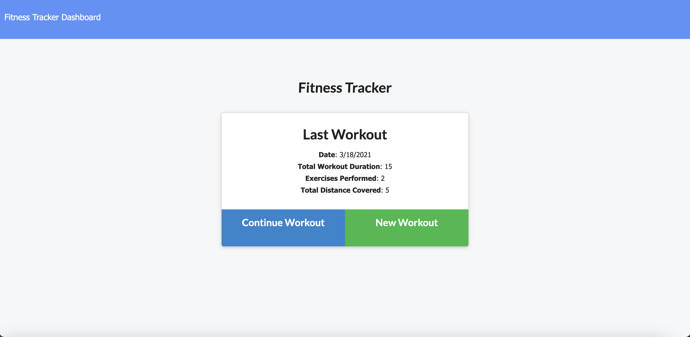
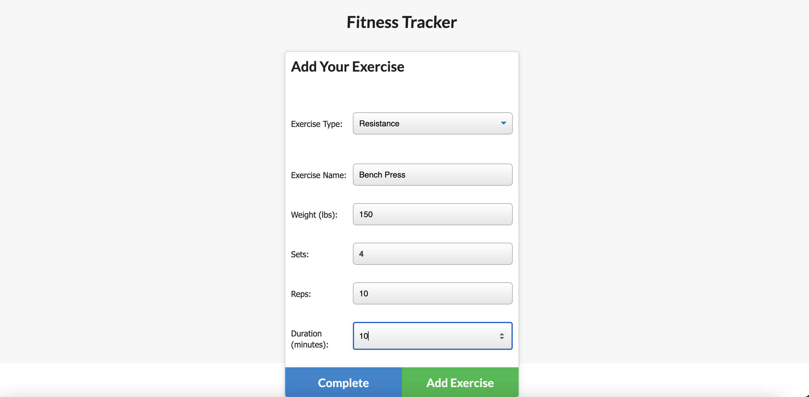
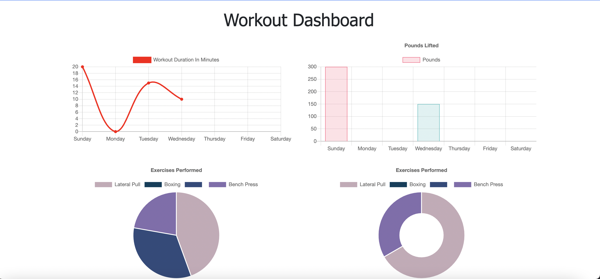

# fitness-tracker
  An application that allows users to view, create and track daily workouts. Also, it allows them to log multiple exercises in a workout on a given day and be able to track the name, type, weight, sets, reps, and duration of the exercise. They will be able to visualize their progress through graphs as well.

## LINK TO THE REPOSITORY

-  [fitness-tracker](https://github.com/LShuqair/fitness-tracker)

## LINK TO Deployed App

-  [fitness-tracker](https://dry-thicket-48234.herokuapp.com/)

## Screen-shot

